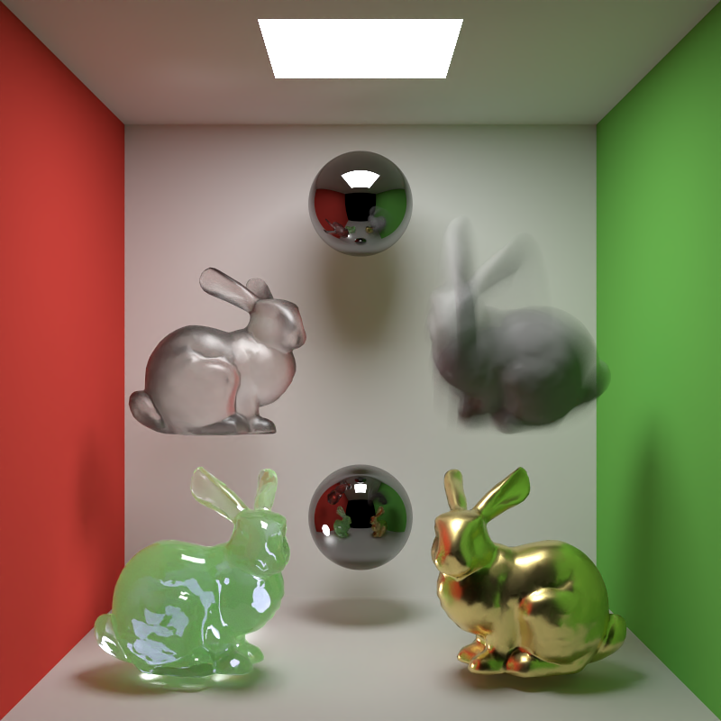

# Gianduia
## Introduction
Gianduia is a hobbyist, physically based rendering engine written in C++. Featuring a modular 
architecture inspired by academic path tracers, and leveraging popular libraries, it's designed 
for rendering complex light transport, including microfacet models 
and participating media.

<p align="center">
  
</p>

### Disclaimers

This repository is actively under development as a side project. Parts of the code base
(including this readme) are subject to future revision, and many features are planned (see the 
roadmap). The development is driven mainly on MacOS, and other platforms are still to be tested thoroughly. 
Nevertheless, you're still welcome to look around the code base.


## Features

Along with the core library functionalities, namely math and infrastructure utilities, 
the following list of features has been implemented.

* **Integrators:** 
  * A regular and a volumetric path tracer, using *Multiple Importance Sampling*.
  * Debug integration routines (e.g. normals, ambient occlusion).
* **Materials:** 
  * Conductor, glass, matte and plastic materials, all with dedicated sampling strategies. 
  * Homogeneous participating media with multiple scattering.
* **Optics:** 
  * Perspective camera (traditional pinhole model).
  * Thin lens camera, featuring depth of field, barrel distortion, chromatic aberration (both axial and transversal), and rolling shutter.
  * Motion blur, both for camera and objects.
* **Other:** 
  * Denoising using Intel OpenImageDenoise.

## Building
The project is built using CMake (version 3.20 or higher required) and relies on `vcpkg` in manifest mode for dependency management.

### Requirements

* A compiler with C++20 support (GCC, Clang, or MSVC).
* CMake >= 3.20
* [vcpkg](https://github.com/microsoft/vcpkg) for automatic dependencies management.

### Instructions

1. Clone the repository:
   ```bash
   git clone https://github.com/daverlez/gianduia.git
   cd gianduia
   ```

2. Configure the project, pointing CMake to the vcpkg toolchain file. For instance, via command line or in your CLion CMake options:

    ```bash
    cmake -B build -S . -DCMAKE_TOOLCHAIN_FILE=~/vcpkg/scripts/buildsystems/vcpkg.cmake
    ```
    (Make sure to adjust the toolchain path to match your local vcpkg installation directory).

3. Compile:

    ```bash
    cmake --build build --config Release
   ```
4. Run the example scene:

    ```bash
   cd build
   ./Gianduia --headless --denoise ../docs/preview/cbox.xml
   ```
   Or simply launch ./Gianduia to get the GUI.

### Dependencies
All dependencies are handled automatically by vcpkg based on the provided 
manifest (OpenImageDenoise is the only exception, whose binaries are fetched during the 
CMake configuration phase).

* **GLAD**, **GLFW**, **ImGui**: handle GUI executable and ongoing render view.
* **OpenEXR**, **stb**: interaction both with HDR and LDR image formats.
* **GLM**: underlying math library.
* **TBB**: multithreaded CPU execution.
* **TinyOBJLoader**: load meshes in OBJ format.
* **OpenVDB**: load and query VDB grids for participating media.
* **GTest**: unit testing.
* **OpenImageDenoise**: denoising using auxiliary buffers.


## Roadmap
There's quite a bit of updates listed for the future. Here follows some of the next ones, listed in order
of planned development.

* *Blender plugin* to export scenes to Gianduia's  XML description.
* *Disney's principled BSDF*.
* *Conversion tool* between Guianduia's and XML scene descriptors.
* *Hair BSDF*.
* *Validation* of heterogeneous participating media. 
* *CI/CD pipeline* via GitHub Actions, validating different platforms.
* *Photon Mapping*.
* *Post-processing* filters: bloom, tone mapping.
* *Realistic camera* model.

## Acknowledgments

This project is heavily inspired by the following resources:

* **[PBRT](https://github.com/mmp/pbrt-v3):** The architecture and physical foundations follow the principles outlined in *Physically Based Rendering: From Theory To Implementation* by Matt Pharr, Wenzel Jakob, and Greg Humphreys.
* **[Mitsuba Renderer](https://github.com/mitsuba-renderer/mitsuba3):** The scene description philosophy is influenced by the Mitsuba 3 project.
* **[Nori 2](https://cgl.ethz.ch/teaching/cg25/www-nori/index.html)**: Before developing Gianduia, working on Nori during the Computer Graphics class at ETH Zurich gave me a grasp of the concepts, along some insights I carried on to this project.