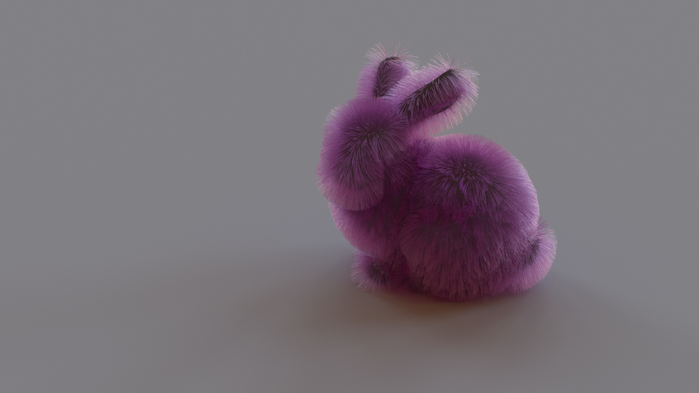
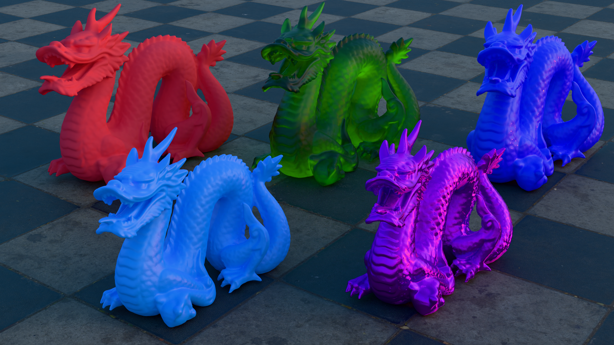
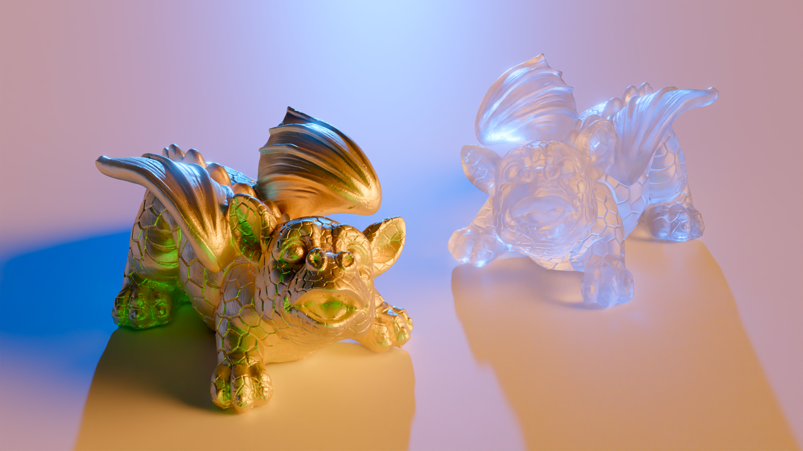
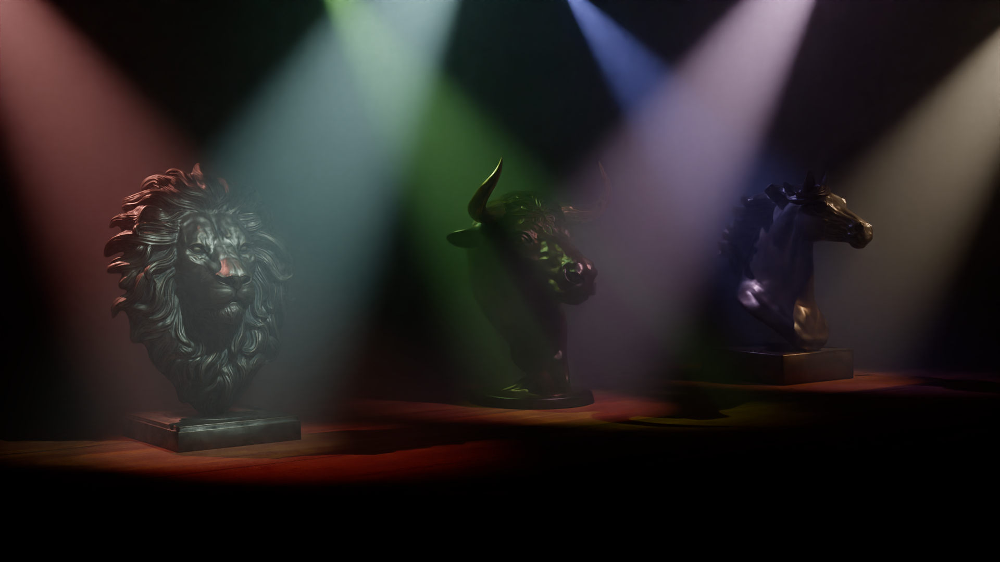
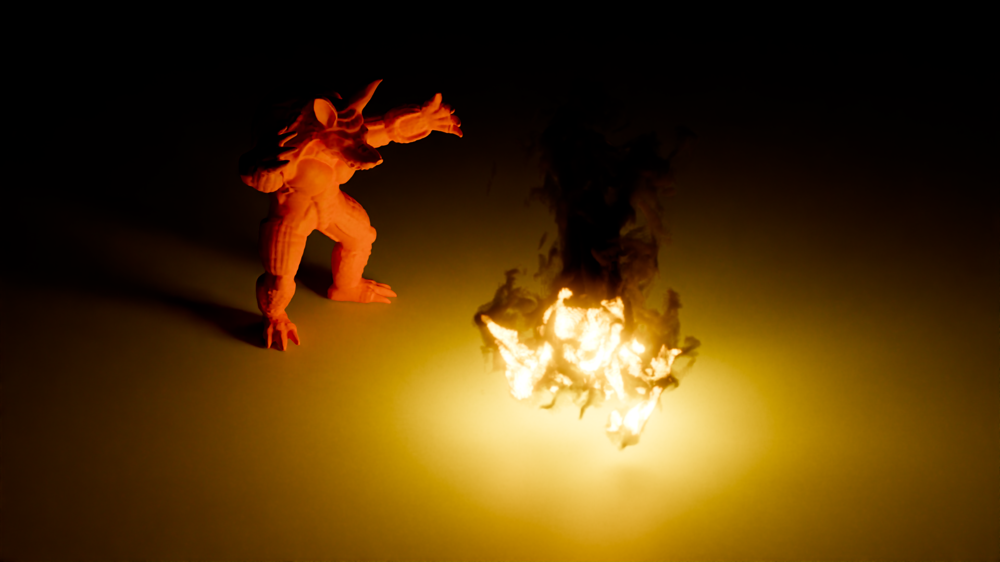
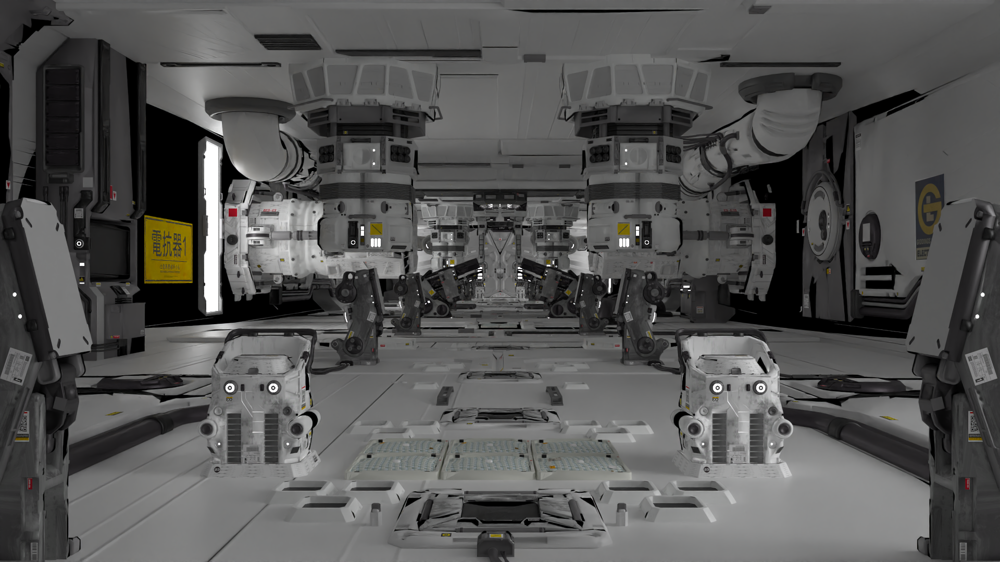
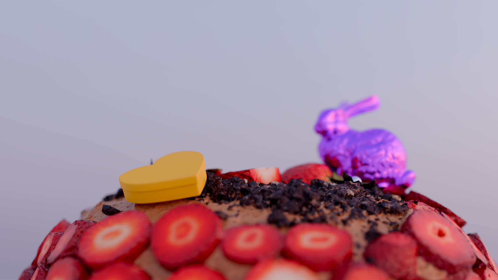

# Gianduia
## Introduction
Gianduia is a hobbyist, physically based rendering engine written in C++. Featuring a modular 
architecture inspired by academic path tracers, and leveraging popular libraries, it's designed 
for rendering complex light transport and exploring different appearance models and rendering techniques.

<p align="center">
  
  <br/>
  <small>
    <strong>Furry Bunny</strong><br/>
    The Stanford bunny covered with fur (<i>50k curves</i>), shaded with the Marschner model.<br/>
    <i>Features: Marschner Hair BSDF, Curve Rendering.</i><br/>
    <i>Models: Stanford Graphics Library.</i><br/>
    <i>Envmap: Polyheaven.</i>
  </small>
</p>


## Features

* **Cross-platform development** 
  * Gianduia has been tested on different platforms, namely MacOS (`aarch64` and `x86-64`), Windows (`x86-64`) 
  and Linux (`x86-64`).
  * Some routines use SIMD vectorization to boost the performance in critical parts of the system. These parts of the 
  codebase, along with the multi-threading code, are written using dedicated abstraction libraries to work on different systems.
* **Interactive GUI**
  * Though the project supports headless execution by launching the render from the command line, the repository comes with 
  a dedicated GUI which shows the render in progress. Along that, an interactive view of the acceleration data structure 
  of the scene is provided.
  * The GUI layout features dedicated buttons to visualize auxiliary buffers of the rendered scene and apply post-processing
  filters directly in Gianduia, including denoising, various tone mapping filters and a tunable bloom effect.
* **Materials** 
  * The project provides implementations for different materials: matte, conductor, glass, plastic, principled (_Burley_), and hair (_Marschner_).
  * Both `homogeneous` and `heterogeneous` participating media are implemented, enabling both the loading of VDB grids or procedural generation.
  * Different noise algorithms are implemented to generate procedural textures, which can be used to model both albedo and material parameters or bumps.
  The same noise functions can be used to evaluate volumes.
* **Integrators** 
  * The `volpath` integrator enables the rendering of all the effects, including volumes, applying _Multiple Importance Sampling_ approaches both on surfaces and volumes.
  * Additionally, a `photonmapper` integrator has been implemented to render scenes with complex caustics.

## Building
The project is built using CMake (version 3.20 or higher required) and relies on `vcpkg` in manifest mode for dependency management.

### Requirements

* A compiler with C++20 support (GCC, Clang, or MSVC).
* CMake >= 3.20
* [vcpkg](https://github.com/microsoft/vcpkg) for automatic dependency management.
### System Prerequisites

#### Linux / WSL (Ubuntu)

Before running the cmake build step, install the following system-level dependencies.
These are required by GLFW3 and OpenVDB and are not handled automatically by vcpkg:

```bash
sudo apt update
sudo apt install libxinerama-dev libxcursor-dev xorg-dev libglu1-mesa-dev pkg-config
```

> **Note:** This has been tested on Ubuntu 24.04 (x86-64) under WSL (Windows Subsystem for Linux).
> Other distributions will require equivalent packages via their own package manager (e.g. `pacman` on Arch, `dnf` on Fedora).

### Instructions

1. Clone the repository:
   ```bash
   git clone https://github.com/daverlez/gianduia.git
   cd gianduia
   ```

2. Configure the project, pointing CMake to the vcpkg toolchain file. For instance, via command line or in your CLion CMake options:

    ```bash
    cmake -B build -S . -DCMAKE_TOOLCHAIN_FILE=~/vcpkg/scripts/buildsystems/vcpkg.cmake
    ```
    (Make sure to adjust the toolchain path to match your local vcpkg installation directory).

3. Compile:

    ```bash
    cmake --build build --config Release
   ```
4. Run the example scene:

    ```bash
   cd build
   ./Gianduia --headless --denoise ../docs/preview/cbox.xml
   ```
   Or simply launch ./Gianduia to get the GUI.

### Dependencies

* **GUI application**
  * GLAD
  * GLFW
  * ImGui
* **Image I/O**
  * stb
  * OpenEXR
* **Math**
  * GLM 
  * TinyOBJLoader
  * OpenVDB
* **Multi-threading and SIMD**
  * TBB
  * Google Highway
* **Others**
  * Google Test
  * Intel OpenImageDenoise
  * pugixml


## Gallery


<table width="100%">
  <tr>
    <td width="50%" valign="top">
      
      <br/>
      <p align="center">
        <strong>Principled Dragons</strong><br/>
        Showcasing different parameters of Burley's principled BSDF.<br/>
        <i>Features: Principled BSDF.</i><br/>
        <i>Models: Stanford Graphics Library.</i><br/>
        <i>Envmap: Polyheaven.</i>
      </p>
    </td>
    <td width="50%" valign="top">
      
      <br/>
      <p align="center">
        <strong>Dragon Buddies</strong><br/>
        Models displaying the implemented conductor (gold) and dielectric (glass) materials.<br/>
        <i>Features: Conductor BSDF, Dielectric BSDF.</i><br/>
        <i>Models: PBRT scenes.</i><br/>
        <i>Envmap: Polyheaven.</i>
      </p>
    </td>
  </tr>
</table>

<table width="100%">
  <tr>
    <td width="50%" valign="top">
      
      <br/>
      <p align="center">
        <strong>Animal Statues</strong><br/>
        Three animal heads embedded in a homogeneous medium, lit by spotlights.<br/>
        <i>Features: Homogeneous participating media, Volumetric MIS.</i><br/>
        <i>Models: Polyheaven.</i>
      </p>
    </td>
    <td width="50%" valign="top">
      
      <br/>
      <p align="center">
        <strong>Armadillo Camp</strong><br/>
        The Stanford armadillo standing in front of a campfire, loaded from VBD grids.<br/>
        <i>Features: Heterogeneous participating media, Volumetric Emission.</i><br/>
        <i>Models: Stanford Graphics Library, JangaFX.</i>
      </p>
    </td>
  </tr>
</table>

<table width="100%">
  <tr>
    <td width="50%" valign="top">
      
      <br/>
      <p align="center">
        <strong>Measure One</strong><br/>
        Benchmark scene with high geometric density.<br/>
        <i>Features: BVH Acceleration.</i><br/>
        <i>Models: BEEPLE Zero-Day, NVIDIA.</i>
      </p>
    </td>
    <td width="50%" valign="top">
      
      <br/>
      <p align="center">
        <strong>Strawberries</strong><br/>
        Macro-photography of a cake with toppings.<br/>
        <i>Features: Thin-lens Camera model, Depth of Field (DoF).</i><br/>
        <i>Models: Stanford Graphics Library, Polyheaven.</i><br/>
        <i>Envmap: Polyheaven.</i>
      </p>
    </td>
  </tr>
</table>

## Acknowledgments

This project is heavily inspired by the following resources:

* **[PBRT](https://github.com/mmp/pbrt-v3):** The architecture and physical foundations follow the principles outlined in *Physically Based Rendering: From Theory To Implementation* by Matt Pharr, Wenzel Jakob, and Greg Humphreys.
* **[Mitsuba Renderer](https://github.com/mitsuba-renderer/mitsuba3):** The scene description philosophy is influenced by the Mitsuba 3 project.
* **[Nori 2](https://cgl.ethz.ch/teaching/cg25/www-nori/index.html)**: Before developing Gianduia, working on Nori during the Computer Graphics class at ETH Zurich gave me a grasp of the concepts, along some insights I carried on to this project.
